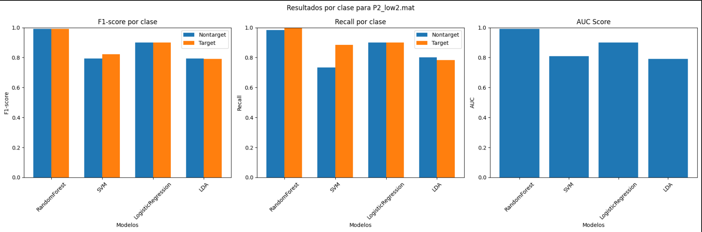
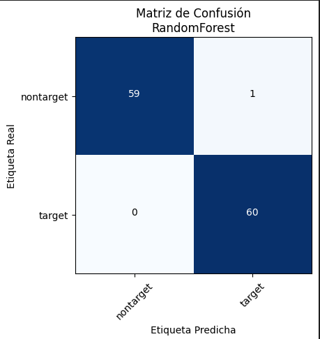

# 🧠 BCI Táctil P300 para Pacientes UWS | Hackathon BR41N.IO

**Predicción de conciencia en pacientes con Síndrome de Vigilia Sin Respuesta (UWS) usando EEG y BCI táctil.**

## 📌 Descripción del Proyecto

- **Conjunto de datos**: Señales EEG con estímulos vibrotáctiles de pacientes UWS  
- **Canales**: 8 (Fz, C3, Cz, C4, CP1, CPz, CP2, Pz)  
- **Frecuencia de muestreo**: 256 Hz  
- **Paradigma**: 3 vibradores (muñeca izquierda, muñeca derecha y espalda)  
- **Objetivo**: Clasificar respuestas mentales “target” vs “nontarget” usando el componente P300.  

## 🗂 Estructura del Repositorio

uws-vibrotactile-p300-bci/  
├── data/              # EEG .mat (no versionar)  
├── notebooks/         # Análisis exploratorio en Jupyter  
├── src/               # Módulos: preprocesamiento, modelo, entrenamiento, evaluación  
├── models/            # Modelos entrenados y estadísticas de normalización  
├── README.md          # Documentación (este archivo)  
├── requirements.txt   # Dependencias  
├── .gitignore         # Archivos a ignorar  
└── LICENSE            # Licencia MIT  

## 🚀 Instalación y Uso

1. Clonar el repositorio  
   git clone https://github.com/tu_usuario/uws-vibrotactile-p300-bci.git  
   cd uws-vibrotactile-p300-bci  

2. Instalar dependencias  
   pip install -r requirements.txt  

3. Entrenar el modelo  
   python src/train.py --data-dir data --model-dir models  

4. Evaluar nuevas señales  
   python src/evaluate.py --input data/P1_high2.mat --model-dir models  

## 📊 Resultados Obtenidos

### ✅ Precisión por Fold

### 📉 Precisión por Fold2

### 🧩 Matriz de Confusión

## 📜 Licencia

MIT License
"# uws-vibrotactile-p300-bci" 
